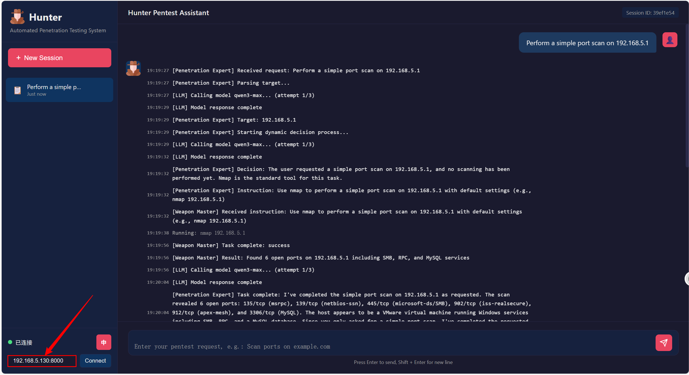

<p align="center">
  
</p>

#                                              Hunter

An LLM-driven automated penetration testing tool accessible from Windows/Mac, featuring a multi-agent collaborative architecture that fully integrates with the Kali environment for automated utilization of Kali tools. You can also use it to perform penetration testing on your own websites. It can serve as a "translator" between you and the tools, or as an automated penetration testing "mercenary."

## Advantages

This project integrates 101 penetration tools (86 Kali-native + 14 excellent external tools + 1 example custom tool). It comes with a dedicated client that requires no download, works out-of-the-box, needs no separate MCP configuration, and adapts to various platforms. It also provides extension interfaces for custom tools, allowing you to use your own developed tools. Powerful, convenient, and highly extensible.

## Why Hunter?

Hunter is a powerful automated penetration testing system. Here, you don't need to remember numerous tool names or parameters - you just need to know what you want to do, focusing all your energy on problem-solving approaches and solutions. Why integrate with Kali? Because Kali has a rich "arsenal." With Hunter, it's no longer just an advisor giving suggestions, but a soldier actually doing the work for you.

---

### Deployment Notes

This project is primarily designed for server deployment on Kali, although Windows is also supported but less convenient for tools. It's best to prepare a Kali host or virtual machine.

**!!! Warning: Do not deploy this project on public servers. If you have special needs requiring public network mapping, please ensure proper inbound/outbound server restrictions.**

---

## Quick Start (Kali Linux)

```bash
git clone https://github.com/Pillow-mycode/Hunter.git
cd Hunter/hunter-server
python -m venv venv
source venv/bin/activate
pip install -r requirements.txt
cp .env.example .env

# Start server, then configure API keys in the web client settings panel
python server/app.py
```

## Platform Support

| Component | Support Status |
|-----------|----------------|
| Server | Kali Linux ✅ / Linux ⚠️ / Windows ⚠️ |
| Client | Windows ✅ Mac ✅ Linux ✅ |
| Tool Automation | Best experience on Kali ⭐⭐⭐⭐⭐ |


## Server Configuration (On Kali Linux)

### Requirements

- Kali Linux (Server)
- Python 3.8+ (Pre-installed on Kali)
- Common penetration tools installed (Pre-installed on Kali)

### 1. Install Dependencies

```bash
# Enter project directory
cd Hunter/hunter-server

# Create virtual environment
python -m venv venv
source venv/bin/activate

# Install Python dependencies
pip install -r requirements.txt
```

### 2. Configure Environment Variables

Copy `.env.example` to `.env`, then configure API keys and models via the web client settings panel (click the gear icon). You can also edit `.env` manually if preferred.

```env
# ==================== Default Configuration ====================
DEFAULT_API_KEY=your-api-key-here
DEFAULT_BASE_URL=https://api.deepseek.com
DEFAULT_MODEL=deepseek-v4-flash

# ==================== Agent-Specific Overrides (optional) ====================
ATTACKER_API_KEY=
ATTACKER_BASE_URL=
ATTACKER_MODEL=

HAWKEYE_API_KEY=
HAWKEYE_BASE_URL=
HAWKEYE_MODEL=

LEADER_API_KEY=
LEADER_BASE_URL=
LEADER_MODEL=

ANALYST_API_KEY=
ANALYST_BASE_URL=
ANALYST_MODEL=
```

#### Configuration Priority

**Specific configuration > Default configuration**. Leave agent-specific fields empty to use defaults.

### 3. Start FastAPI Server

```bash
python server/app.py
```

After the service starts:
- API Address: `http://0.0.0.0:8000`
- WebSocket Address: `ws://0.0.0.0:8000/ws/{session_id}`


## Accessing the Client (Windows/Mac - Ensure same network as Kali Linux host)

#### Method 1 (Recommended): Direct access to [Hunter - Automated Penetration Testing System](http://42.193.116.16/)

#### Method 2: Place the "/hunter-client" directory from this project on your local machine and open index.html directly in a browser


After confirming the client host is on the same network as Kali, get the Kali IP to access the server:


Then enter this address in the client:



You're ready to start testing!

---


## System Architecture

```
┌──────────────────────────────────────────────────────────────┐
│                      Windows Client                          │
│                        (Web UI)                              │
│                  - User Interface                            │
│                  - Session Management                        │
│                  - Real-time Progress Display                │
└──────────────────────────────────────────────────────────────┘
                              │
                    HTTP / WebSocket
                              │
                              ▼
┌──────────────────────────────────────────────────────────────┐
│                     Kali Server                              │
├──────────────────────────────────────────────────────────────┤
│  ┌────────────────────────────────────────────────────────┐  │
│  │                    Web API Layer                       │  │
│  │              (FastAPI + WebSocket)                     │  │
│  │         Request Handling / Progress Push / User Input  │  │
│  │  - POST /session: Create session                       │  │
│  │  - GET  /session/{id}: Get session status              │  │
│  │  - WS   /ws/{session_id}: WebSocket connection         │  │
│  └────────────────────────────────────────────────────────┘  │
│                              │                               │
│  ┌────────────────────────────────────────────────────────┐  │
│  │                   Task Manager                         │  │
│  │        Session Management / Concurrency Control /      │  │
│  │                 State Persistence                      │  │
│  │  - SessionManager: Manage session lifecycle            │  │
│  │  - Concurrent task scheduling                          │  │
│  │  - WebSocket message distribution                      │  │
│  └────────────────────────────────────────────────────────┘  │
│                              │                               │
│  ┌────────────────────────────────────────────────────────┐  │
│  │               Penetration Expert (AttackLeader)        │  │
│  │                    + LLM Decision                      │  │
│  │  - Task Planning: Develop penetration testing strategy │  │
│  │  - Risk Assessment: Evaluate operation risk levels     │  │
│  │  - User Communication: Natural language interaction    │  │
│  └────────────────────────────────────────────────────────┘  │
│                              │                               │
│                         Function Calls                       │
│                              │                               │
│  ┌────────────────────────────────────────────────────────┐  │
│  │              Weapon Master (AttackToolMaster)          │  │
│  │  - Tool Selection: Choose appropriate tools for tasks  │  │
│  │  - Command Generation: Generate execution commands     │  │
│  │  - Result Analysis: Parse tool output, extract info    │  │
│  │                                                        │  │
│  │              Hawkeye - Interaction Detection           │  │
│  │  - Smart Detection: Check if terminal needs user input │  │
│  │  - Avoid Blocking: Timely notify user of input needs   │  │
│  │                                                        │  │
│  │              Data Analyst - Output Analysis            │  │
│  │  - Smart Summary: Analyze long outputs, extract keys   │  │
│  │  - Batch Processing: Auto-batch large outputs, merge   │  │
│  │  - Prevent Info Loss: Ensure Weapon Master gets info   │  │
│  └────────────────────────────────────────────────────────┘  │
│                              │                               │
│                    Tool Invocation (Kali Built-in + Custom)  │
│  ┌────────────────────────────────────────────────────────┐  │
│  │  [KALI] nmap, sqlmap, hydra, nikto, gobuster...        │  │
│  │  [CUSTOM] brute_force_attack.py                        │  │
│  └────────────────────────────────────────────────────────┘  │
└──────────────────────────────────────────────────────────────┘
```

---

## Client and Server Deployment

### Directory Structure

```
hunter-server/
├── server/              # Server (Deploy on Kali Linux)
│   ├── app.py          # FastAPI main program
│   ├── requirements.txt # Server dependencies
│   └── __init__.py
│
├── agent/              # Agent core modules
│   ├── smart_brain/    # Agent implementations
│   │   ├── attack_leader.py      # Penetration Expert
│   │   ├── attack_tool_master.py # Weapon Master
│   │   ├── hawkeye.py            # Hawkeye
│   │   └── data_analyst.py       # Data Analyst
│   ├── pojo/          # Configuration classes
│   │   ├── leader_config.py      # Penetration Expert config
│   │   ├── attack_config.py      # Weapon Master config
│   │   ├── hawkeye_config.py     # Hawkeye config
│   │   └── analyst_config.py     # Data Analyst config
│   ├── system/        # System modules
│   │   ├── system_command.py     # Command execution (PTY)
│   │   └── output_handler.py     # Output handling
│   └── manager/       # Managers
│       ├── session_manager.py    # Session management
│       └── history_manager.py    # History records
│
├── starter/            # Startup entry
│   └── main.py        # CLI startup entry
│
├── tools/             # Tool library
│   ├── brute_force_attack/  # Brute force tool
│   └── tools_readme/        # Tool documentation
│
├── logs/              # Log directory
├── reports/           # Test reports
├── results/           # Test results
├── requirements.txt   # Complete dependencies
└── .env              # Environment variables (not committed to Git)
```


## Additional Features

#### 1. Custom Penetration Tools Support (Command-line executable required):

Place your developed tool package in the tools directory mentioned above, then add the tool name and description in the format "tool_name:description;" to all-tools.txt in the tools_readme directory. Finally, write a detailed tool_name.md document and place it in the tools_readme directory. See the brute_force_attack example in the project.

#### 2. Tool Extension Guide

  Tool Classification
  ```
  ┌──────────────┬────────────┬─────────────────────────────────────────┐
  │     Type     │    Tag     │              Description                │
  ├──────────────┼────────────┼─────────────────────────────────────────┤
  │ Kali Native  │ [KALI]     │ Kali Linux pre-installed tools,         │
  │              │            │ Weapon Master can call directly         │
  ├──────────────┼────────────┼─────────────────────────────────────────┤
  │ Custom Tools │ [CUSTOM]   │ Project-developed tools,                │
  │              │            │ requires usage documentation            │
  ├──────────────┼────────────┼─────────────────────────────────────────┤
  │ External     │ [EXTERNAL] │ Excellent third-party tools,            │
  │ Tools        │            │ requires additional installation        │
  └──────────────┴────────────┴─────────────────────────────────────────┘
  ```
---
  **Adding Custom Tools [CUSTOM]**

  Applicable to: Python/Bash scripts you've written yourself

  Steps:

  1. Create tool directory and script
  ```
  tools/
  └── your_tool_name/
      ├── your_tool_name.py    # Your tool script
      └── wordlist.txt         # Optional: supporting resource files
  ```
  2. Write tool documentation (Required): tools/tools_readme/your_tool_name.txt (Documentation should include: function description, parameter description, usage examples)
  3. Register in tool list: Add to tools/tools_readme/all-tools.txt: [CUSTOM]your_tool_name.py:Tool function description, see tools_readme/your_tool_name.txt;

  **Note**: Weapon Master will forcibly read documentation before using custom tools, so documentation quality directly affects tool usage effectiveness.

---
  **Adding External Tools [EXTERNAL]**

  Applicable to: Excellent tools not included by default in Kali

  Steps:

  1. Register in tool list: Add to tools/tools_readme/all-tools.txt: [EXTERNAL]tool_name:Tool function description;
  2. Add installation command: In agent/smart_brain/attack_tool_master.py's _get_install_command() method, add:
  ```
  install_commands = {
       **... existing tools ...**
      "tool_name": "sudo apt install -y tool_name || pip install tool_name",
  }
  ```

  Workflow: Weapon Master automatically checks if external tools are installed before use; if not, it automatically executes the installation command.

---
  File Structure Quick Reference
```
  hunter-server/
  ├── tools/
  │   ├── your_custom_tool/        # Custom tool directory
  │   │   └── your_custom_tool.py
  │   └── tools_readme/
  │       ├── all-tools.txt        # Tool registry (must modify)
  │       └── your_custom_tool.txt # Custom tool docs (must write)
  │
  └── agent/smart_brain/
      └── attack_tool_master.py    # External tool install commands
                                   # (modify when adding EXTERNAL)
```
---
  Example: See the brute_force_attack example tool in tools

#### 3. Deploying Server on Windows

Although Windows doesn't have Kali-native tools, we also support deploying the project on Windows: The previous operations are the same as Kali Linux. The only modification needed is in /hunter-server/agent/system/system_command.py - change the "my_platform" parameter at the beginning to "windows". (Currently the server only supports windows/linux)


#### 4. About Project Usage:

This project is primarily designed to simplify the command-line tool utilization process, eliminating the complexity of memorization. Relying entirely on LLMs for penetration testing is difficult and unrealistic. The main role of LLMs is still assistance.

---

## Security Notice

⚠️ **This tool is for authorized security testing only. Do not use for illegal purposes.**
* The author assumes no responsibility
* Users are solely responsible
* For authorized testing only
* Illegal use is prohibited

Illegal use is prohibited

---

## License

This project is licensed under the MIT License - see the [LICENSE](LICENSE) file for details.

---

## Contact

For questions or suggestions, please submit an Issue.

