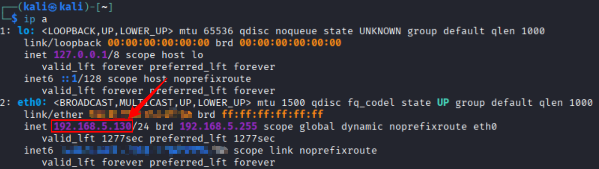
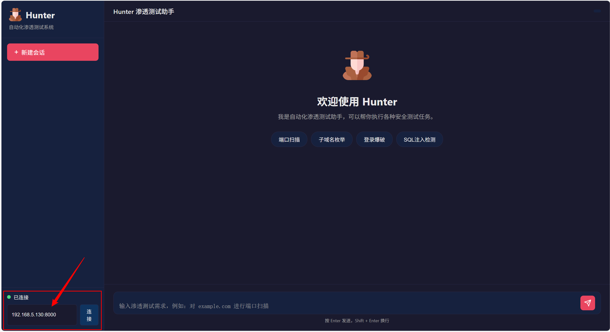

<p align="center">
  
</p>

#                                              Hunter

一款基于 LLM 驱动的可在windows/mac上访问的自动化渗透测试工具，采用多智能体协作架构，可以在Kali环境下充分集成，实现Kali工具的自动化利用。你也可以用它对你自己的网站进行渗透性测试，所以它既可以是你与工具之间的“翻译官”，也可以是你的自动化渗透的“雇佣兵”。

## 优势
本项目集成了共101种渗透工具（kali原生支持86种 + 外部优秀工具14种 + 示例自定义工具1种）。配有专门的客户端，无需下载、开箱即用，无需单独配置MCP，而且适应各种平台。还提供了自定义工具的扩展接口，使用自己编订的工具。功能强大、方便、可扩展性强。

## 为什么需要

Hunter 是一个强大的自动化渗透测试系统。在这里，你不需要记住那些多而杂的工具名或参数，你只需要清楚自己想干什么，将所有经历专注于问题思路和解决方案上。为什么集成在Kali上？因为Kali上有着丰富的”武器库“，只需要加上它，Hunter将不再是一个只会给建议的指挥员，而是真正为你做事的士兵。

---

### 部署说明

本项目主推将服务端部署到Kali上，虽然也支持Windows，但工具方面没有Kali方便。所以最好准备一台Kali主机或虚拟机。Kali虚拟机安装方式参考：[Kali Linux下载安装及配置（VMware虚拟机）保姆级图文教程（持续更新）kali安装2026最新，0基础可用，保姆级图文（2024年11月19日发布，2026/1/1最新更新）_kali虚拟机-CSDN博客](https://blog.csdn.net/m0_74030222/article/details/143866270?ops_request_misc=elastic_search_misc&request_id=1f3cdc30a9a4f5a0e585ab6f06852f7f&biz_id=0&utm_medium=distribute.pc_search_result.none-task-blog-2~all~top_positive~default-1-143866270-null-null.nonlogin&utm_term=kali)

**！！！注意：尽量不要将本项目部署到公网服务器上， 如果有特殊需求需要映射到公网，请做好服务器出入站限制**

---
## 快速启动(Kali Linux)

```bash
git clone https://github.com/Pillow-mycode/Hunter.git
cd Hunter/hunter-server
python -m venv venv
source venv/bin/activate
pip install -r requirements.txt

cp .env.example .env

# 请按需配置 .env
# 可以配置语言，默认是英文，可以改为中文。
# 通过将LANGUAGE=en 改为LANGUAGE=zh 切换为中文
nano .env

python server/app.py
```

## 平台支持

| 组件 | 支持情况 | 语言 |
|------|---------|---------|
| 服务端 | Kali Linux ✅ / Linux ⚠️ / Windows ⚠️ | 中文/英文 |
| 客户端 | Windows ✅ Mac ✅ Linux ✅ | 中文/英文 |
| 工具自动化 | Kali 最佳体验 ⭐⭐⭐⭐⭐ |  |


## 配置服务端（Kali Linux上）

### 环境要求

- Kali Linux（服务端）

- Python 3.8+ （Kali自带）
- 安装常用渗透工具（Kali 预装）

### 1. 安装依赖

```bash
#克隆项目
git clone https://github.com/Pillow-mycode/Hunter.git
#进入项目
cd Hunter/hunter-server

#创建虚拟环境
python -m venv venv
source venv/bin/activate

# 安装 Python 依赖
pip install -r requirements.txt
```

### 2. 配置环境变量

在Hunter/hunter-server目录下创建 `.env` 文件并进入，粘贴并配置以下内容（注意：这里有四部分，可以仅配置第一个默认部分其他为空即可，如需要单独为不不同智能体选择不同模型直接填入信息即可，默认优先级：专门配置 > 默认配置）：

```env
# ==================== 默认配置 （快速启动只需填写这一部分即可）====================
# Default Configuration (Only fill this section for quick start)
# 当各智能体的专用配置为空时，使用这些默认值
# These default values are used when agent-specific configurations are empty
DEFAULT_API_KEY=your-api-key-here
DEFAULT_BASE_URL=https://dashscope.aliyuncs.com/compatible-mode/v1
DEFAULT_MODEL=qwen3-max

# ==================== 语言配置 ====================
# 设置系统语言
# zh = 中文 (Chinese), en = English
# 此设置会影响大模型的回复语言和系统消息
LANGUAGE=en

# ==================== 武器大师配置 ====================
# 负责工具选择和命令执行
ATTACKER_API_KEY=
ATTACKER_BASE_URL=
ATTACKER_MODEL=

# ==================== 鹰眼配置 ====================
# 负责检测终端是否需要用户交互
HAWKEYE_API_KEY=
HAWKEYE_BASE_URL=
HAWKEYE_MODEL=

# ==================== 渗透专家配置 ====================
# 负责任务规划和决策
LEADER_API_KEY=
LEADER_BASE_URL=
LEADER_MODEL=

# ==================== 数据分析员配置 ====================
# 负责分析超长命令输出，提取关键信息
# 建议使用便宜的小模型，如 qwen-turbo、glm-4-flash
ANALYST_API_KEY=
ANALYST_BASE_URL=
ANALYST_MODEL=

```

#### 配置说明

- **API Key**：必填，填写你的 LLM 服务商 API Key（如阿里云 DashScope、OpenAI 等）
- **Base URL**：必填，API 服务地址
- **Model**：必填，使用的模型名称

#### 配置优先级

每个智能体的配置都遵循优先级规则：**专用配置 > 默认配置**

示例：
- 如果 `ATTACKER_API_KEY` 有值 → 使用 `ATTACKER_API_KEY`
- 如果 `ATTACKER_API_KEY` 为空 → 使用 `DEFAULT_API_KEY`
- 如果两者都为空 → 报错

#### 推荐配置方案

**方案 1：统一配置（推荐）**
```env
DEFAULT_API_KEY=sk-xxx
DEFAULT_BASE_URL=https://api.example.com/v1
DEFAULT_MODEL=gpt-4

# 其他配置留空，自动使用默认值
ATTACKER_API_KEY=
HAWKEYE_API_KEY=
LEADER_API_KEY=
```

**方案 2：差异化配置**
```env
DEFAULT_API_KEY=sk-xxx

# 武器大师使用更强的模型
ATTACKER_MODEL=qwen3-max-latest

# 鹰眼使用更快的模型（降低成本）
HAWKEYE_MODEL=qwen3-turbo

# 渗透专家使用默认模型
LEADER_API_KEY=
```

### 3. 启动 FastAPI 服务端

```bash
python server/app.py
```

服务启动后：
- API 地址：`http://0.0.0.0:8000`
- WebSocket 地址：`ws://0.0.0.0:8000/ws/{session_id}`


## 访问客户端（Windows/Mac 确保和Kali Linux主机在同一内网下）

#### 方式1（推荐）：直接访问  [Hunter - 自动化渗透测试系统](http://42.193.116.16/)

#### 方式2：将本项目的 ”/hunter-clinet“ 目录直接放到本机上，用浏览器直接打开其中的index.html即可


确定客户端主机与kali在同一内网下后需要拿到kali的IP，用来访问服务端：



再将此地址填入客户端即可：



完成后即可开始测试！！

---


## 系统架构图

```
┌──────────────────────────────────────────────────────────────┐
│                      Windows 客户端                           │
│                        (Web UI)                              │
│                  - 用户交互界面                              │
│                  - 会话管理                                  │
│                  - 实时进度展示                              │
└──────────────────────────────────────────────────────────────┘
                              │
                    HTTP / WebSocket
                              │
                              ▼
┌──────────────────────────────────────────────────────────────┐
│                     Kali 服务端                              │
├──────────────────────────────────────────────────────────────┤
│  ┌────────────────────────────────────────────────────────┐  │
│  │                    Web API 层                          │  │
│  │              (FastAPI + WebSocket)                     │  │
│  │         接收请求 / 进度推送 / 用户交互                   │  │
│  │  - POST /session: 创建会话                            │  │
│  │  - GET  /session/{id}: 获取会话状态                    │  │
│  │  - WS   /ws/{session_id}: WebSocket 连接               │  │
│  └────────────────────────────────────────────────────────┘  │
│                              │                               │
│  ┌────────────────────────────────────────────────────────┐  │
│  │                   任务管理器                            │  │
│  │        会话管理 / 并发控制 / 状态持久化                  │  │
│  │  - SessionManager: 管理会话生命周期                   │  │
│  │  - 并发任务调度                                      │  │
│  │  - WebSocket 消息分发                                │  │
│  └────────────────────────────────────────────────────────┘  │
│                              │                               │
│  ┌────────────────────────────────────────────────────────┐  │
│  │               渗透专家 (AttackLeader)                   │  │
│  │                    + LLM 决策                           │  │
│  │  - 任务规划：制定渗透测试策略                         │  │
│  │  - 风险评估：评估操作风险等级                         │  │
│  │  - 用户沟通：用自然语言与用户交流                     │  │
│  └────────────────────────────────────────────────────────┘  │
│                              │                               │
│                         函数调用                             │
│                              │                               │
│  ┌────────────────────────────────────────────────────────┐  │
│  │              武器大师 (AttackToolMaster)                │  │
│  │  - 工具选择：根据任务选择合适的工具                   │  │
│  │  - 命令生成：生成执行命令                           │  │
│  │  - 结果分析：解析工具输出并提取关键信息               │  │
│  │                                                        │  │
│  │              鹰眼 (Hawkeye) - 交互检测                   │  │
│  │  - 智能判断：检测终端是否需要用户输入                │  │
│  │  - 避免阻塞：及时通知用户输入需求                     │  │
│  │                                                        │  │
│  │              数据分析员 (DataAnalyst) - 输出分析         │  │
│  │  - 智能摘要：分析超长命令输出，提取关键发现           │  │
│  │  - 分批处理：自动分批处理超大输出，汇总结果           │  │
│  │  - 避免信息丢失：确保武器大师获得完整的关键信息       │  │
│  └────────────────────────────────────────────────────────┘  │
│                              │                               │
│                    工具调用 (Kali 内置 + 自定义)            │
│  ┌────────────────────────────────────────────────────────┐  │
│  │  [KALI] nmap, sqlmap, hydra, nikto, gobuster...   │  │
│  │  [CUSTOM] brute_force_attack.py                      │  │
│  └────────────────────────────────────────────────────────┘  │
└──────────────────────────────────────────────────────────────┘
```

---

## 客户端和服务端部署

### 目录结构

```
hunter-server/
├── server/              # 服务端（部署在 Kali Linux）
│   ├── app.py          # FastAPI 服务主程序
│   ├── requirements.txt # 服务端依赖
│   └── __init__.py
│
├── agent/              # 智能体核心模块
│   ├── smart_brain/    # 智能体实现
│   │   ├── attack_leader.py      # 渗透专家
│   │   ├── attack_tool_master.py # 武器大师
│   │   ├── hawkeye.py            # 鹰眼
│   │   └── data_analyst.py       # 数据分析员
│   ├── pojo/          # 配置类
│   │   ├── leader_config.py      # 渗透专家配置
│   │   ├── attack_config.py      # 武器大师配置
│   │   ├── hawkeye_config.py     # 鹰眼配置
│   │   └── analyst_config.py     # 数据分析员配置
│   ├── system/        # 系统模块
│   │   ├── system_command.py     # 命令执行（PTY）
│   │   └── output_handler.py     # 输出处理
│   └── manager/       # 管理器
│       ├── session_manager.py     # 会话管理
│       └── history_manager.py    # 历史记录
│
├── starter/            # 启动入口
│   └── main.py        # CLI 启动入口
│
├── tools/             # 工具库
│   ├── brute_force_attack/  # 暴力破解工具
│   └── tools_readme/       # 工具文档
│
├── logs/              # 日志目录
├── reports/           # 测试报告
├── results/           # 测试结果
├── requirements.txt   # 完整依赖
└── .env              # 环境变量配置（不提交到 Git）
```


## 额外功能

#### 1、本项目还支持自定义渗透工具（要求命令行运行）做法：

将开发的工具包放入上面的目录的tools目录下，然后将工具的名称与简介按 "tool_name:description;" 填入 tools_readme 目录下的 all-tools.txt 中，最后写一个详细的 tool_name.md 文档放入 tools_readme 目录下即可。可以看项目中 brute_force_attack 的例子。

#### 2、工具扩展指南

  工具分类说明         
  ```
  ┌──────────────┬────────────┬─────────────────────────────────────────┐
  │     类型     │    标签     │                  说明                   │                                                                                  
  ├──────────────┼────────────┼─────────────────────────────────────────┤      
  │ Kali原生工具  │ [KALI]     │ Kali Linux 预装工具，武器大师可直接调用    │
  ├──────────────┼────────────┼─────────────────────────────────────────┤
  │ 自定义工具    │ [CUSTOM]   │ 项目自研工具，需编写使用文档               │
  ├──────────────┼────────────┼─────────────────────────────────────────┤
  │ 外部工具      │ [EXTERNAL] │ 优秀的第三方工具，需额外安装               │
  └──────────────┴────────────┴─────────────────────────────────────────┘
  ```
---
  **添加自定义工具 [CUSTOM]**

  适用于：你自己编写的 Python/Bash 脚本工具

  步骤：

  1. 创建工具目录和脚本
  ```
  tools/
  └── your_tool_name/
      ├── your_tool_name.py    # 你的工具脚本
      └── wordlist.txt         # 可选：配套资源文件
  ```
  2. 编写工具文档（必须）：tools/tools_readme/your_tool_name.txt（文档应包含：功能说明、参数说明、使用示例）
  3. 注册到工具列表：在 tools/tools_readme/all-tools.txt 中添加：[CUSTOM]your_tool_name.py:工具功能描述，详见 tools_readme/your_tool_name.txt;

  **注意**： 武器大师使用自定义工具前会强制阅读文档，所以文档质量直接影响工具的使用效果。

---
  **添加外部工具 [EXTERNAL]**

  适用于：优秀但 Kali 默认不自带的第三方工具

  步骤：

  1. 注册到工具列表：在 tools/tools_readme/all-tools.txt 中添加：[EXTERNAL]tool_name:工具功能描述;
  2. 添加安装命令：在 agent/smart_brain/attack_tool_master.py 的 _get_install_command() 方法中添加：
  ```
  install_commands = {
       **... 已有工具 ...**
      "tool_name": "sudo apt install -y tool_name || pip install tool_name",
  }
  ```

  工作流程： 武器大师使用外部工具时会自动检查是否已安装，未安装则自动执行安装命令。

---
  文件结构速查
```
  hunter-server/
  ├── tools/
  │   ├── your_custom_tool/        # 自定义工具目录
  │   │   └── your_custom_tool.py
  │   └── tools_readme/
  │       ├── all-tools.txt        # 工具注册表（必改）
  │       └── your_custom_tool.txt # 自定义工具文档（必写）
  │
  └── agent/smart_brain/
      └── attack_tool_master.py    # 外部工具安装命令（添加EXTERNAL时需改）
```
---
  示例：请看tools中的brute_force_attack示例工具

#### 3、关于服务端部署到windows的做法
尽管windows中没有kali原生工具，但是我们也支持了将项目部署到windows的做法：前面的操作和Kali Linux一样，唯一需要修改的地方为/hunter-server/agent/system/system_command.py文件中，开头有一个参数 "my_platform" 将其改为"windows"即可。（当前服务端只支持windows/linux）


#### 4、关于项目用法：

本项目关键还是主要用于简化命令行工具利用过程，省去记忆的复杂性。做渗透测试如果想要完全的凭借大模型是难以达到的，并且也是不现实的。大模型最主要的作用还是辅助。

---

## 安全提示

⚠️ **本工具仅用于授权的安全测试，请勿用于非法目的**
* 作者不承担责任
* 用户自行负责
* 仅用于授权测试
* 禁止非法用途

禁止非法用途
---

## 许可证

本项目基于 MIT 许可证开源 - 详情请查看 [LICENSE](LICENSE) 文件。

---

## 联系方式

如有问题或建议，欢迎提交 Issue。
